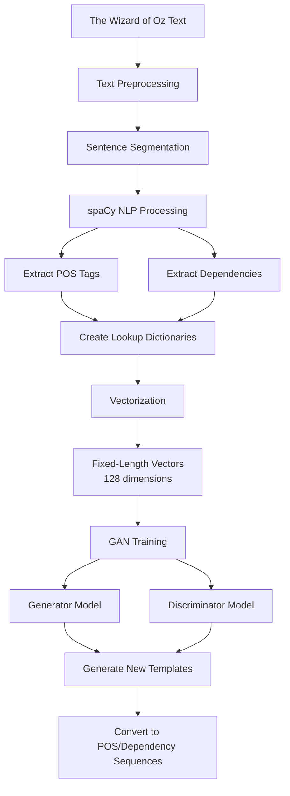
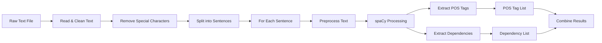
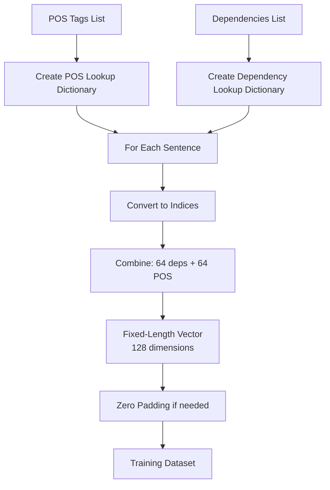
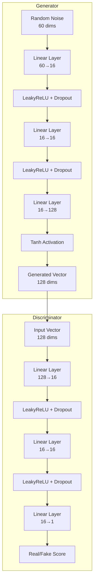
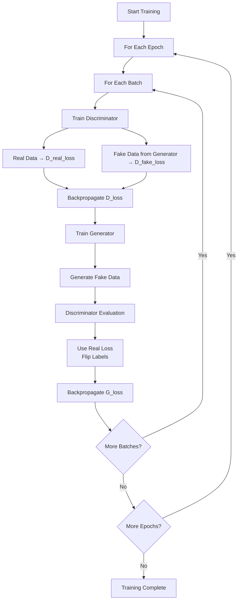
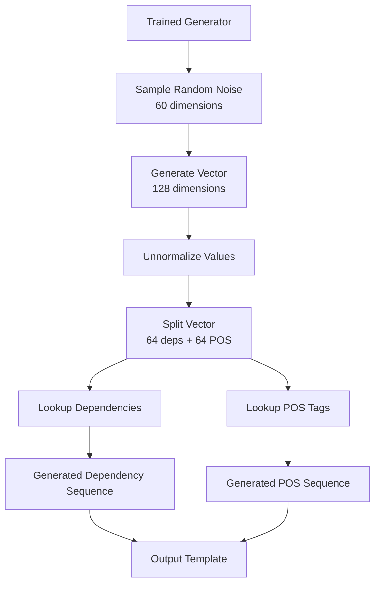

# Generated Sentence Templates using GANs and spaCy

This project generates sentence templates using Generative Adversarial Networks (GANs) trained on linguistic features extracted from "The Wizard of Oz" novel using spaCy. Instead of generating actual words, the model learns to generate grammatical structures in the form of Part-of-Speech (POS) tags and dependency relations.

## Project Overview

## Detailed Workflow

### 1. Data Preprocessing Pipeline

### 2. Vectorization Process

### 3. GAN Architecture

### 4. Training Process

### 5. Generation Process

## Architecture Details

### Model Specifications

- **Input Vector Size**: 128 dimensions (64 dependencies + 64 POS tags)
- **Sentence Length**: Fixed at 64 tokens
- **Generator**:
  - Input: 60-dimensional noise vector
  - Hidden Layers: 2 fully connected layers (16 neurons each)
  - Output: 128-dimensional vector
  - Activation: Tanh
  
- **Discriminator**:
  - Input: 128-dimensional vector
  - Hidden Layers: 2 fully connected layers (16 neurons each)
  - Output: 1-dimensional score (real/fake)
  - Activation: LeakyReLU (0.2)

### Training Parameters

- **Epochs**: 20
- **Batch Size**: 32
- **Learning Rate**: 0.00002
- **Optimizer**: Adam
- **Dropout**: 0.3

## Key Features

1. **Linguistic Feature Extraction**: Uses spaCy to extract grammatical structures rather than raw text
2. **Template Generation**: Generates sentence templates (POS + dependencies) instead of actual words
3. **Fixed-Length Encoding**: All sentences converted to uniform 128-dimensional vectors
4. **GAN-based Learning**: Adversarial training to learn realistic sentence structures

## Dependencies

- spaCy (`en_core_web_sm` model)
- PyTorch
- NumPy
- scikit-learn
- Google Colab (for file mounting)

## Usage

The project is implemented as a Jupyter notebook (`576_Spacy_Vector_GANsipynb.ipynb`). Run the cells sequentially to:

1. Mount Google Drive and load the text file
2. Process text with spaCy
3. Create vectorized training data
4. Train the GAN
5. Generate new sentence templates

## Output

The model generates sequences of:
- **Dependency Relations**: e.g., `['ROOT', 'nsubj', 'dobj', 'prep', ...]`
- **POS Tags**: e.g., `['NOUN', 'VERB', 'DET', 'ADJ', ...]`

These can be used as templates for generating grammatically structured sentences.
